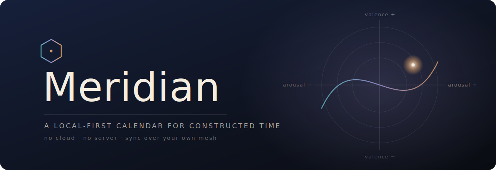

<div align="center">



<br/>

[](https://swift.org)
[](#)
[](https://github.com/automerge/automerge-swift)
[](https://tailscale.com)
[](#privacy-is-the-architecture-not-a-setting)
[](#how-it-is-built)

***A calendar that watches how time lands on you — and refuses to tell you what to feel about it.***

</div>

---

## The one-sentence version

**Meridian** is a privacy-first, local-first calendar for iPhone, iPad, and the macOS menu bar
that treats your schedule as something you *experience*, not just something you *store* — and
that does so without ever naming, scoring, or judging an emotion. It syncs only across your own
devices, over your own [Tailscale](https://tailscale.com) mesh. No cloud. No server. No account.
No telemetry.

---

## Why it is built the way it is

Most calendars model time as inventory: slots, conflicts, reminders. Meridian adds one more
axis — **how a given window of time actually tends to feel** — and then handles that signal with
unusual restraint. The restraint is not decoration. It is the direct architectural consequence of
the theory the affect model is built on.

> Meridian is grounded in Lisa Feldman Barrett's **theory of constructed emotion** — that emotions
> are not fingerprints waiting to be detected, but predictions the brain *constructs* from core
> affect plus context and concepts. ([Barrett, 2017](#theoretical-grounding))

If emotions are constructed rather than read off the body, then a piece of software has no business
claiming to *detect* one. So Meridian doesn't. It records only the raw ingredients an honest system
can record, computes only what those ingredients license, and surfaces only what is actually
actionable. Everything the theory says you can't legitimately infer, the app refuses to display.

### Three commitments that fall out of the theory

| Constructed-emotion premise | What Meridian does |
|---|---|
| Affect is dimensional (core affect), not categorical | Stores **valence**, **arousal**, and **clarity** as continuous values — never an emotion label |
| Interoceptive signals vary in precision | Treats **clarity** as an interoceptive-precision weight, not a confidence score shown to you |
| The brain runs on prediction error | Computes **ε**, the distance of a check-in from your own learned baseline — and acts only when error is *sustained* |

---

## What it does *not* do — on purpose

The discipline is the product. These are not missing features; they are load-bearing refusals.

- **No emotion words.** `stress`, `anxiety`, `burnout`, `excited`, and every derivative are banned
  from *all* system-generated copy. Zero exceptions. The system never tells you what you felt.
- **No scores, no dials, no readouts.** Your valence/arousal/clarity values are computed and stored;
  they are *never* rendered back to you as a number, gauge, or chart. There is no "mood graph."
- **No wellness theater.** No streaks, no completion percentages, no "you were productive today,"
  no nudges to journal. The single response the system is permitted is a quiet, optional
  *schedule-review* prompt — "this window has been running differently than your usual" — and nothing more.
- **No causal claims.** Prompts never say *why*. No "because of," no "due to." The app surfaces a
  pattern; the meaning is yours to construct.
- **No cloud.** Affect data is local, full stop. It is never transmitted, never escrowed, never
  trained on.

The result is a tool that can notice "the last few Tuesday mornings have landed far from your
baseline" without ever presuming to know that you were *anxious* — because, per the theory, it
genuinely doesn't, and pretending otherwise would be a category error wearing a UI.

---

## The affect model

Three dimensions, stored as `Float32`, mapped directly onto core affect plus an interoceptive
precision term:

| Dimension | Range | Maps to |
|---|---|---|
| **Valence** | −1.0 … +1.0 | Core-affect valence (pleasant ↔ unpleasant) |
| **Arousal** | −1.0 … +1.0 | Core-affect arousal (activated ↔ quiet) |
| **Clarity** | 0.0 … 1.0 | Interoceptive precision — how legible the signal was |

Check-ins are partitioned into **six time-of-week buckets** (weekday/weekend × morning/midday/evening;
midnight–05:00 folds into the previous evening). A bucket only earns a **baseline** after **7**
check-ins, computed over a rolling **28**-check-in window, and is considered *stable* only once its
dimensions settle below a per-dimension σ threshold.

A new check-in's **prediction error** is its Euclidean distance from the bucket's baseline in
3-D affect space:

```
ε = √( (Vₙₑᵥ − µ_V)² + (Aₙₑᵥ − µ_A)² + (Cₙₑᵥ − µ_C)² )      ε_max = 3.0,  ε_threshold = 0.85
```

A schedule-review prompt becomes available only when error is **sustained** — 3 high-error
check-ins inside a 7-day rolling window — and then enters a 14-day cooldown. Single bad mornings
are noise; the system waits for a pattern. The entire affect engine is **computation-only**:
it reads, it computes µ/σ and ε, it writes results back into the document, and it hands the UI
exactly one bit — *show the prompt, or don't.*

---

## How it is built

```
MeridianCore   ── all business logic: CRDT documents, affect engine, sync protocol
MeridianUI     ── SwiftUI views only; no logic ever crosses this line   (Layer 2)
MeridianApp    ── entry point only                                       (Layer 2)
```

- **CRDTs over a clock.** State lives in two [Automerge](https://github.com/automerge/automerge-swift)
  documents — `EventDoc` and `AffectDoc` — so that 1–3 personal devices can edit offline and merge
  without a server, without last-write-wins data loss, and without trusting a wall clock across a mesh.
- **Sync is your network, not ours.** A local HTTP server binds *exclusively* to the Tailscale
  interface (`:47301`) and exchanges binary deltas peer-to-peer. If Tailscale isn't up, sync is
  simply *unavailable* — never silently downgraded to some lesser transport.
- **Encrypted at rest, opaquely.** The whole Automerge `save()` output is sealed as opaque bytes
  with CryptoKit **ChaChaPoly** (AEAD). The on-disk frame is `MRDN ‖ version ‖ nonce ‖ ciphertext+tag`,
  with the header bound as authenticated data — flip a byte of the version or nonce and decryption
  fails closed. The 256-bit key is generated on first launch and lives in the **Keychain**
  (`AfterFirstUnlockThisDeviceOnly`, never escrowed to iCloud). Writes are atomic.

---

## Accessibility is structural

Not a post-MVP line item. Every UI component must answer all five before it ships: VoiceOver
(label/hint/trait), Dynamic Type at XXXL, Reduce Motion, High-Contrast/Grayscale rendering, and a
hard ceiling of **three** simultaneous decisions on screen. Color is never the sole carrier of
state, and no VoiceOver label may use an emotion word.

---

## Privacy is the architecture, not a setting

There is no privacy *toggle* because there is no other mode. Affect data never leaves the device.
Sync rides your own mesh. Storage is encrypted with a device-bound key. Enrichment content is
bundled or permanently cached — never fetched at display time. The honest version of "we don't
look at your data" is *we built it so we can't.*

---

## Status

Built in enforced layers; Layer 1 is a hard blocker for everything above it.

| Layer 1 — Tailscale + CRDT substrate | |
|---|---|
| 1 · Package + Automerge-Swift | ✅ |
| 2 · `EventDoc` / `AffectDoc` schema | ✅ |
| 3 · Init, serialization, **encrypted local persistence** | ✅ *(20/20 tests — incl. kill-and-relaunch round-trips and forward-compatible loads)* |
| 4 · Compaction (background + post-sync) | ⬜ next |
| 5 · Local server on the Tailscale interface | ⬜ |
| 6 · Peer discovery + binary delta sync | ⬜ |
| 7 · `MeridianAuth` shared secret in Keychain | ⬜ |

Layer 2 (calendar UI) and Layer 3 (the affect check-in + baseline engine) follow, in that order,
and not before Layer 1 closes.

```bash
swift build          # build MeridianCore
swift test           # run the suite (XCTest)
```

---

## Theoretical grounding

> **Barrett, L. F. (2017).** *The theory of constructed emotion: an active inference account of
> interoception and categorization.* **Social Cognitive and Affective Neuroscience, 12**(1), 1–23.
> [doi:10.1093/scan/nsw154](https://doi.org/10.1093/scan/nsw154) · [PMC5390700](https://www.ncbi.nlm.nih.gov/pmc/articles/PMC5390700/)

Meridian is an independent project and is not affiliated with or endorsed by Dr. Barrett. It is
simply built to take her account seriously enough to *act on it* — including the parts that ask
the software to stay quiet.

<div align="center">
<br/>
<sub><b>⬡ Meridian</b> · constructed time, kept private</sub>
</div>
